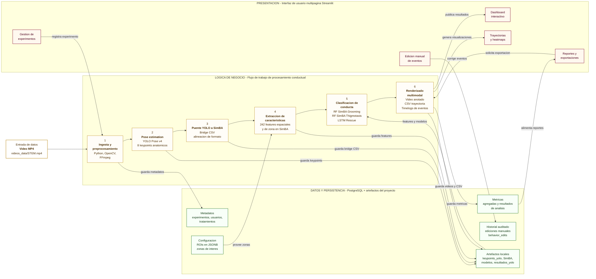

# Diagrama de arquitectura del prototipo

Fecha: 2026-06-01

Arquitectura lógica en 3 capas para el prototipo TT Ratones 2026. El diagrama está simplificado para presentación: muestra una entrada de video, el flujo de trabajo principal de procesamiento, la capa de presentación y la capa de datos/persistencia. Las flechas son direccionales y solo representan transferencia real de datos, comandos o resultados.

## Version recomendada para presentacion

La version mas limpia y controlada esta en:

`reportes/figuras/arquitectura_prototipo.html`

Se abre directamente en el navegador. Esta version evita paréntesis en el texto visible y organiza la arquitectura como una lamina horizontal con tres capas.



## Como renderizarlo

```bash
npx @mermaid-js/mermaid-cli -i reportes/figuras/arquitectura_prototipo.mmd -o reportes/figuras/arquitectura_prototipo.svg
npx @mermaid-js/mermaid-cli -i reportes/figuras/arquitectura_prototipo.mmd -o reportes/figuras/arquitectura_prototipo.png -b white
```

Archivos generados:

- `reportes/figuras/arquitectura_prototipo.mmd`
- `reportes/figuras/arquitectura_prototipo.svg`
- `reportes/figuras/arquitectura_prototipo.png`
